# GRAND GARAGE webapp
This is the sourcecode, that will power grandgarage.eu. A web application for general information and soon to be extended to serve as member portal to interface with services at GRAND GARAGE.

**Disclaimer: this is heavily under development**

## Contributions
We appreciate contributions of any kind.

* clone this repo
* get familiar with Nuxt.js
* contribute

## Dev Setup

**Install Dependencies**
`npm install`

**Run local dev Server**
`npm run dev`

## Prepare for Deployment

**Generate static HTML**
`npm run generate`
